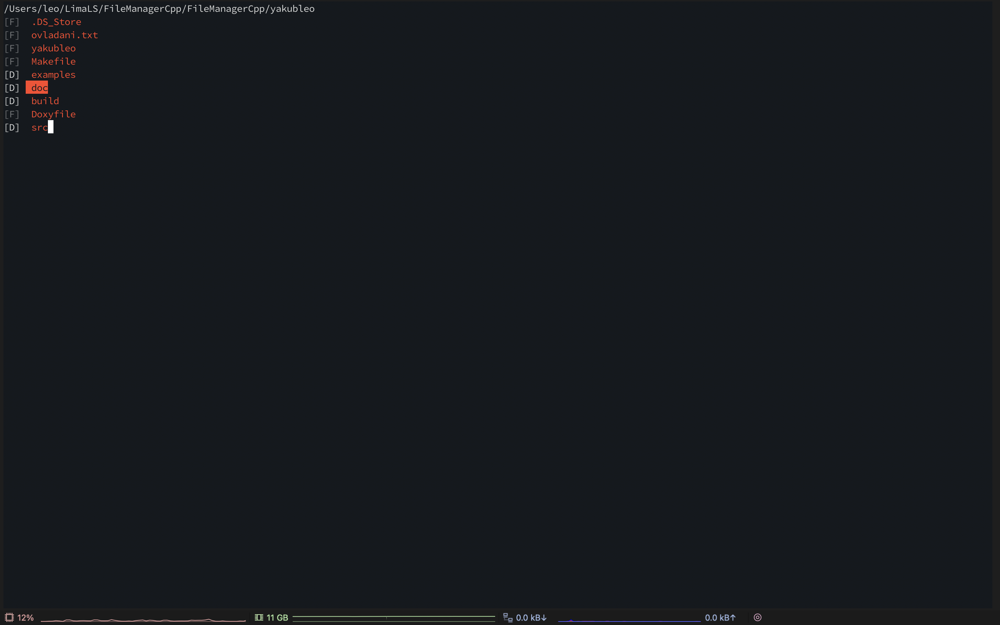

# FileManagerCpp
A linux ubuntu app used for navigating the file system. You will need a c++ compiler and makefile tools installed to compile and run the program.

## How to run:
  - the app is made on linux ubuntu for linux
  - open console
  - go to the yakubleo directory
  - write **make** -> a yakubleo executable will appear
  - write  **./yakubleo**

## How to use the application:
  - **arrow key up:** move cursor up
  - **arrow key down:** move cursor down
  - **a:** create
  - **p:** deduplicate
  - **m:** move
  - **r:** regular expression
  - **c:** copy
  - **d:** delete
  - **o:** concatenate
  - **t:** find by text
  - **u:** move up a directory
  - **ENTER:** open a directory
    

